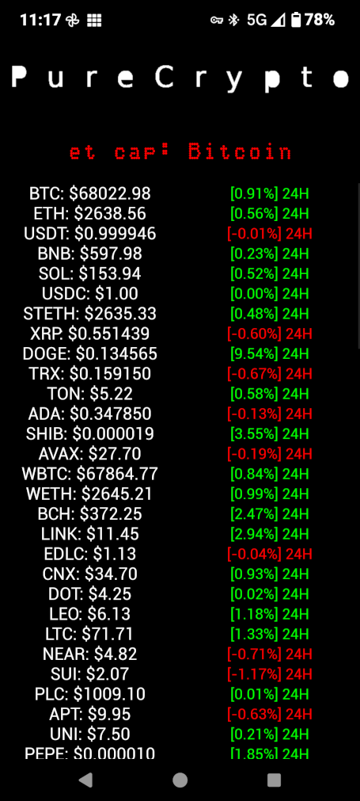

# PureCrypto
PureCrypto is a simple cryptocurrency tracking app that lets you monitor the real-time value of the top 100 cryptocurrencies.  The market capitalisation of the top 20 in a scrolling text LED display

# Features
Real-Time Prices: Get updated prices of the top 100 cryptocurrencies in USD.
Market Capitalization for the top 20 currencies.

# Screenshot 

# Used
Python Kivy Buildozer

# Installation
Download the app directly from the Play Store. 

https://play.google.com/store/apps/details?id=org.bbnss.purecrypto&pcampaignid=web_share

OR

## APK Android
https://github.com/bbnss/PureCrypto/releases/tag/APK
