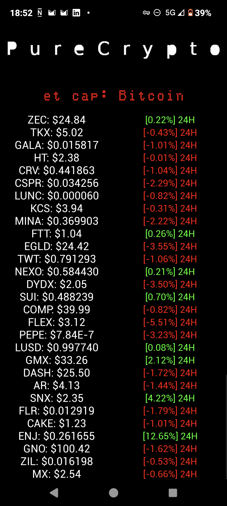
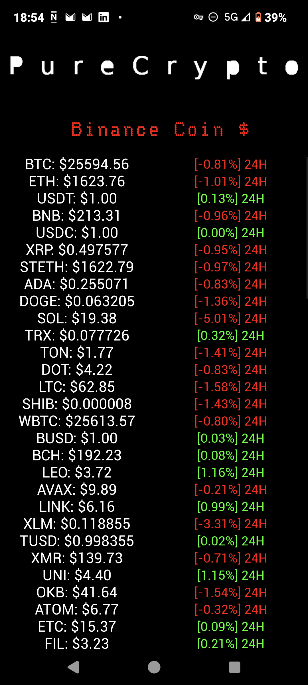

# PureCrypto
PureCrypto is a simple cryptocurrency tracking app that lets you monitor the real-time value of the top 100 cryptocurrencies. Plus, get insights into the market capitalisation of the top 20 in a scrolling text LED display

# Features
Real-Time Prices: Get updated prices of the top 100 cryptocurrencies in USD.
Market Capitalization: Understand the market better with capitalization data for the top 20 currencies.
Simple User Interface: Easy-to-use and intuitive design.
Lightweight: Consumes minimal system resources, ensuring smooth operation.

# Installation
Download the app directly from the Play Store. 

https://play.google.com/store/apps/details?id=org.bbnss.purecrypto&pcampaignid=web_share

# Screenshot 
 

# Technologies Used
Python Kivy Buildozer

# Contributing
If you wish to contribute, please open an issue to discuss your ideas or directly create a pull request.
